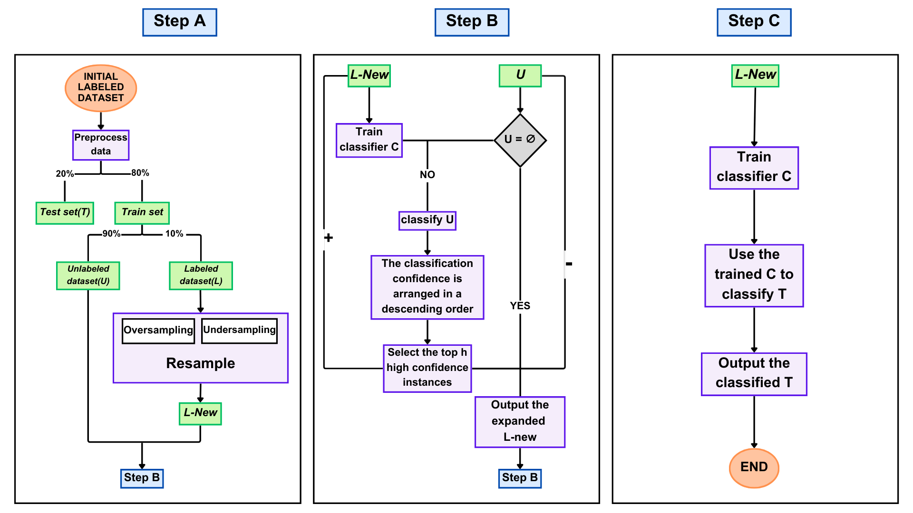
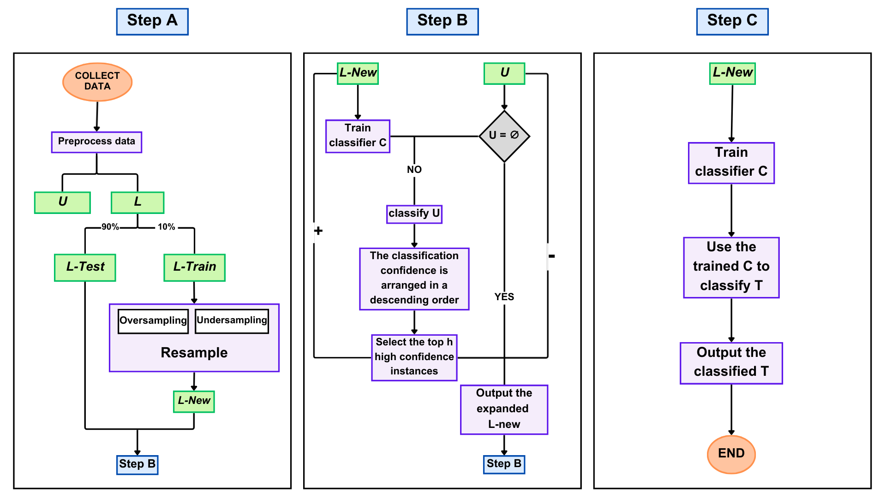

## Methodology

The detection pipeline consists of five main components: preprocessing, handling
class imbalance, feature selection, semi-supervised learning (SSSTR), and classifier
evaluation. Figures 1 and 2 (see below) provide a visual overview of the entire process.

---

### 1. Data Preprocessing
The dataset contains TikTok account metadata and engineered behavioral features.
Preprocessing included:
- cleaning text fields and converting boolean attributes to numeric form,
- normalizing all continuous features using **Min–Max** and **Z-Score** scaling,
- removing unreliable time-based features (Create Time Hour, Weekday, Nickname Time Gap)
  due to time-zone inconsistencies.

Two normalized versions of the dataset were created to examine model sensitivity
to scaling differences.

---

### 2. Handling Class Imbalance
Fake accounts form the minority class. Three strategies were explored:

- **No resampling** — baseline  
- **SMOTE oversampling** — generates synthetic minority instances  
- **CBUTE undersampling** — removes redundant majority samples using a clustering-based strategy  

Resampling was applied only to the **labeled portion** of the data during the
semi-supervised training phase.  
This corresponds to the *“Resample”* block in **Figure 1** and **Figure 2**.

---

### 3. Feature Selection
Two methods were used to obtain compact and informative feature subsets:

- **RFE-SVM (Recursive Feature Elimination)**  
  Iteratively removes the least informative features using linear SVM weights.

- **Bit-Flip Local Search**  
  Starts from an RFE subset and explores neighboring subsets by flipping one
  feature at a time, keeping any subset that improves the metric.

Subsets of 3, 5, 7, and a refined 4-feature combination were evaluated.

---

### 4. Semi-Supervised Self-Training (SSSTR)
The core of the pipeline is a semi-supervised self-training loop that augments
the limited labeled dataset using predictions on a larger unlabeled pool.

**Figure 1** illustrates the general SSSTR pipeline,  
while **Figure 2** shows the version used in this study with an initial
train/test split.

#### SSSTR workflow:
1. Split initial labeled data into **train** and **test** sets (Figure 2).
2. Treat 90% of the training data as **unlabeled (U)** and 10% as **labeled (L)**.
3. Apply SMOTE or CBUTE to rebalance L → produce **L-New**.
4. Train classifier **C** on L-New.
5. Predict labels for all instances in U.
6. Sort predictions by confidence.
7. Select the top high-confidence samples and move them from U to L-New.
8. Repeat until U is empty or no confident instances remain.

The final classifier is then trained on the expanded labeled set and evaluated on
the held-out test set.

---

### 5. Classifiers and Metrics

Six classifiers were evaluated:
- CART  
- Random Forest  
- Gradient Boosting  
- AdaBoost  
- K-Nearest Neighbors  
- Naïve Bayes  

The following metrics were used:
- **Recall (fake class)** — detects fake accounts  
- **G-Mean** — ensures balanced class performance  
- **AUC** — measures overall separability  

These metrics capture both minority-class sensitivity and cross-class stability.

---

## 6. SSSTR Pipeline Diagrams

The following diagrams illustrate the entire semi-supervised workflow:

### **Figure 1 – SSSTR Pipeline (Version 1)**
A high-level structure showing labeled/unlabeled split, resampling, and the
self-training loop.

### **Figure 2 – SSSTR Pipeline (Version 2)**
The version used in this study, which includes an initial train/test split before
entering the self-training loop.

These figures summarize how data flows through the system from preprocessing to
final evaluation.

### 7. Parameter h in Self-Training
#### Definition and Function

In the self-training framework, the parameter **h** determines how many
unlabeled instances are added to the labeled dataset at each iteration.
As introduced by Zeng et al. (2022), the classifier ranks all unlabeled
samples by confidence and selects the top:

    top_h = h × |U|

These selected samples are added to the labeled dataset with their predicted
labels. Over multiple iterations, the labeled set expands progressively,
allowing the classifier to improve using high-confidence pseudo-labels.

---

#### Importance of h

Choosing an appropriate **h** is critical:

- **Small h**
  - Adds only the most confident predictions  
  - Produces cleaner labels  
  - Slows down the learning process  

- **Large h**
  - Labels more samples per iteration  
  - Speeds up learning  
  - Increases risk of adding noisy or incorrect pseudo-labels  

Thus, **h controls the trade-off between learning speed and pseudo-label quality**.

---

#### Experimental Range (from Zeng et al., 2022)

The original study evaluated the following discrete values:

h ∈ {0.05, 0.10, 0.20, 0.30, 0.40, 0.50}

yaml
Copy code

These values were tested to understand how adding different proportions of
high-confidence unlabeled samples affects performance.

The authors reported the following optimal h values:

| Classifier | Optimal h |
|-----------|-----------|
| CART | 0.20 |
| KNN | 0.05 |
| Naïve Bayes | 0.40 |
| Gradient Boosting | 0.50 |
| AdaBoost | 0.50 |
| Random Forest | 0.30 |

---

#### Adopted Configuration in This Research

Because the original h-values were obtained using a **Twitter** dataset,
they may not generalize to TikTok, which has:

- different feature distributions  
- different account behavior  
- different fake–real patterns  

Therefore, in this study, the same candidate values were tested:

h ∈ {0.05, 0.10, 0.20, 0.30, 0.40, 0.50}

Each classifier was evaluated under:

- both normalization methods (Min–Max, Z-score)  
- both resampling methods (SMOTE, CBUTE)  
- using Recall, G-Mean, and AUC  

The best **h** was selected based on performance on the labeled data, then used
consistently during the SSSTR iterations.

---

### Final Selected Values of h

Below are the empirically determined optimal values of **h** under all four
combinations of normalization and resampling.

---

#### **CBUTE + Min–Max Normalization**

| Classifier | Optimal h |
|-----------|-----------|
| CART | 0.20 |
| KNN | 0.10 |
| Naïve Bayes | 0.40 |
| Gradient Boosting | 0.45 |
| AdaBoost | 0.45 |
| Random Forest | 0.30 |

---

#### **CBUTE + Z-Score Normalization**

| Classifier | Optimal h |
|-----------|-----------|
| CART | 0.20 |
| KNN | 0.10 |
| Naïve Bayes | 0.40 |
| Gradient Boosting | 0.40 |
| AdaBoost | 0.45 |
| Random Forest | 0.30 |

---

#### **SMOTE + Min–Max Normalization**

| Classifier | Optimal h |
|-----------|-----------|
| CART | 0.20 |
| KNN | 0.45 |
| Naïve Bayes | 0.40 |
| Gradient Boosting | 0.45 |
| AdaBoost | 0.45 |
| Random Forest | 0.30 |

---

#### **SMOTE + Z-Score Normalization**

| Classifier | Optimal h |
|-----------|-----------|
| CART | 0.20 |
| KNN | 0.05 |
| Naïve Bayes | 0.40 |
| Gradient Boosting | 0.45 |
| AdaBoost | 0.45 |
| Random Forest | 0.30 |

---

