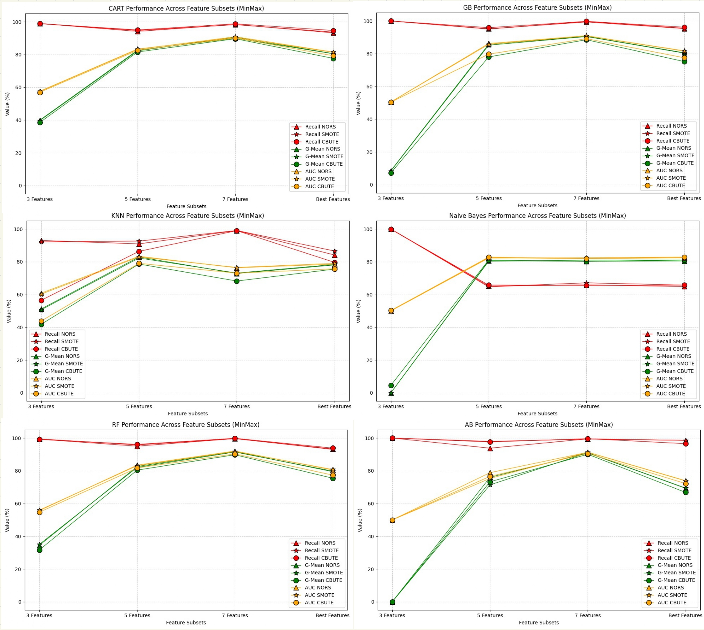
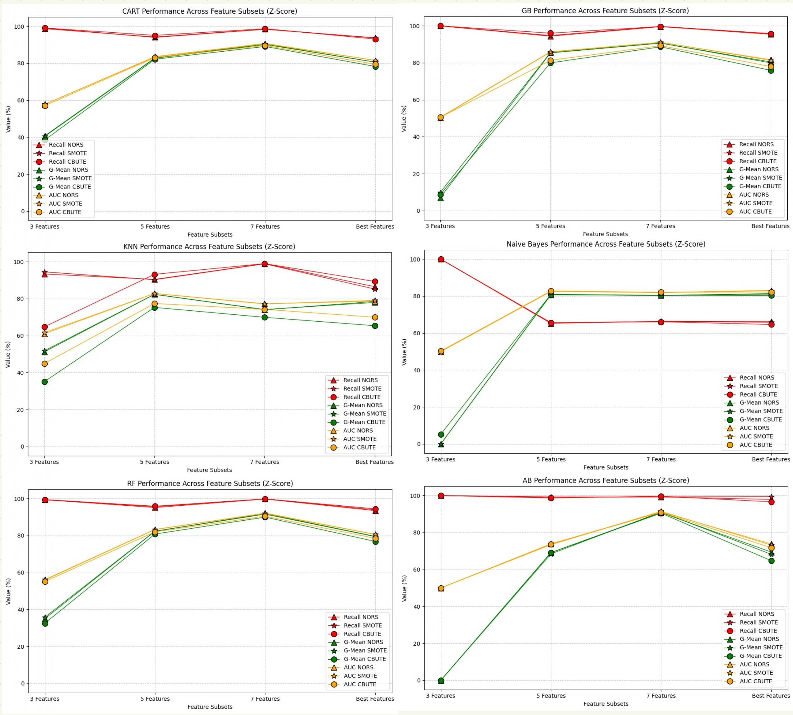

# Results

This document reports the experimental results for TikTok fake-account
detection under different feature subsets, resampling strategies, and
normalization methods. It includes all outputs of RFE-SVM, Bit-Flip
local search, SSSTR, and classifier performance tables.

---

# 1. Feature Selection Results (RFE-SVM and Bit-Flip)

### **Detailed RFE and Bit-Flip Results**

Below are the selected feature subsets obtained through RFE-SVM and the local
search optimization, along with their corresponding accuracies:

- **RFE with 3 Features**  
  - Accuracy: **70.59%**  
  - Selected Features: **Bio, Jaro Similarity, Nickname Complexity**

- **RFE with 5 Features**  
  - Accuracy: **79.02%**  
  - Selected Features:  
    **Face Detected, Bio, Jaro Similarity, Nickname Complexity, Video Count**

- **RFE with 7 Features**  
  - Accuracy: **93.33%**  
  - Selected Features:  
    **Face Detected, Follower Count, Bio, Jaro Similarity,
    Nickname Complexity, Create Time Weekday, Video Count**

- **Best Subset After Local Search (Bit-Flip)**  
  - Accuracy: **80.59%**  
  - Selected Features:  
    **Face Detected, Bio, Jaro Similarity, Video Count**

These results show that feature selection strongly affects detection accuracy,
with the **7-feature subset** performing best and Bit-Flip refinement finding
a compact alternative.

---

# 2. Performance Plots

**Figure 3 – Classifier performance across feature subsets (Min–Max normalization)**  

**Figure 4 – Classifier performance across feature subsets (Z-score normalization)**  

These figures give a visual overview of performance changes as the number of
features increases and how each resampling strategy (NORS, SMOTE, CBUTE)
affects Recall, G-Mean, and AUC.
These figures summarize model behavior for four classifiers (CART, GB, RF, AB) using three evaluation metrics (Recall, G-Mean, AUC) and four feature subsets. Results for the other classifiers are reported in the Appendix. Each classifier here is tested under both Min–Max and Z-Score normalization and evaluated with using SMOTE and CBUTE and without resampling (NORS). In the legend, different shapes represent the resampling strategies (triangles for NORS, stars for SMOTE, and circles for CBUTE), while colors distinguish the evaluation metrics (red for Recall, green for G-Mean, and yellow for AUC). This visual comparison explains how preprocessing choices and feature richness affect detection effectiveness.
In figure 2, CART and GB demonstrate improved AUC, G-Mean, and Recall as the number of features increases. The clearest improvements appear with SMOTE, particularly at five and seven features. With only three features the performance is weaker, especially under CBUTE. SMOTE provides more stable and higher results than NORS and CBUTE.
Figure 3 shows a similar pattern for RF and AB, but with consistently higher values. Z-Score normalization enhances robustness, especially together with SMOTE and larger feature sets. Random Forest achieves the highest AUC and G-Mean in most cases, with AdaBoost close behind. CBUTE underperforms relative to SMOTE.
The experimental results and comparative evaluations in this section provide a detailed assessment of the SSSTR framework for fake account detection on TikTok. In addition to SMOTE and CBUTE, the framework is also evaluated under a no-resampling condition, referred to as NORS (No Resampling Strategy), which serves as a baseline to assess the impact of resampling techniques. These results highlight the importance of proper normalization, handling class imbalance, and selecting informative features. The transition from 3 to 7 features improves detection performance, while the optimized best-feature subset confirms that strong performance can still be achieved with a reduced and interpretable set of features.
Together, these results validate the adaptability of the SSSTR method on TikTok and underline the relevance of careful pre-processing and feature design. The transition from 3 to 7 features improves detection performance, while the best-feature subset confirms that strong classification performance can still be achieved with fewer but informative features, as measured by AUC and G-Mean.

---

# 3. Summary of Best Configurations  
*(Z-Score and Min–Max Normalization)*

This section provides the best-performing classifier + resampling configuration
for each feature subset and summarizes limitations and practical conclusions.

---

## 3.1 Z-Score Normalization

| Feature Subset | Best Classifier + Config | Limitations | Conclusion |
|----------------|--------------------------|-------------|-----------|
| **3 Features** | KNN + SMOTE | G-Mean and AUC remain low; difficult to classify real users correctly. | Not reliable; high Recall but very poor balance. |
| **5 Features** | Gradient Boosting + SMOTE | Some variation across classifiers and resampling methods. | Strong and stable; good trade-off between simplicity and accuracy. |
| **7 Features** | Random Forest + SMOTE | Only moderate improvement over 5 features; more complex. | Best overall accuracy; preferred when performance is the priority. |
| **Best (4 Features)** | Random Forest + SMOTE | Slight drop in G-Mean/AUC vs 7 features. | Very compact and strong; excellent balance of simplicity and performance. |

---

## 3.2 Min–Max Normalization

| Feature Subset | Best Classifier + Config | Limitations | Conclusion |
|----------------|--------------------------|-------------|-----------|
| **3 Features** | KNN + SMOTE | Very weak class balance; real users frequently misclassified. | Insufficient information; not useful alone. |
| **5 Features** | Random Forest + SMOTE | Misses fine-grained behavior features; some classifier instability. | Strong and consistent improvement over 3 features. |
| **7 Features** | Random Forest + SMOTE | Only small gains over 5 features; higher complexity. | Highest overall metrics; recommended for best accuracy. |
| **Best (4 Features)** | Random Forest + SMOTE | Slightly lower AUC/G-Mean vs 7 features. | Efficient and effective; recommended when fewer features are preferred. |

---

# 4. Full Numerical Results  
*(All Values Are Percentages)*

Below are the complete results for all 8 configurations:

- 3 features (Min–Max)
- 3 features (Z-Score)
- 5 features (Min–Max)
- 5 features (Z-Score)
- 7 features (Min–Max)
- 7 features (Z-Score)
- Best features (Min–Max)
- Best features (Z-Score)

---

# 4.1 Three Features (Min–Max Normalization)

### **Table 1 — 3 Features + Min–Max**

| Evaluation Index | Sampling | CART | RF | GB | AB | KNN | Naïve Bayes |
|------------------|----------|------|----|----|----|-----|-------------|
| **Recall** | NORS | 98.98 | 99.30 | 99.97 | 100.00 | 93.03 | 100.00 |
| | SMOTE | 98.91 | 99.46 | 99.97 | 100.00 | 92.15 | 100.00 |
| | CBUTE | 98.88 | 99.21 | 99.96 | 100.00 | 56.47 | 99.92 |
| **G-Mean** | NORS | 39.96 | 34.47 | 8.53 | 0.00 | 51.16 | 0.00 |
| | SMOTE | 39.67 | 35.05 | 8.35 | 0.00 | 50.66 | 0.00 |
| | CBUTE | 38.53 | 31.65 | 7.19 | 0.00 | 41.81 | 4.54 |
| **AUC** | NORS | 57.61 | 55.68 | 50.47 | 50.00 | 60.85 | 50.00 |
| | SMOTE | 57.45 | 55.96 | 50.49 | 50.00 | 60.23 | 50.00 |
| | CBUTE | 56.98 | 54.71 | 50.39 | 50.00 | 43.79 | 50.26 |

---

# 4.2 Three Features (Z-Score Normalization)

### **Table 2 — 3 Features + Z-Score**

| Evaluation Index | Sampling | CART | RF | GB | AB | KNN | Naïve Bayes |
|------------------|----------|------|----|----|----|-----|-------------|
| **Recall** | NORS | 98.72 | 99.40 | 99.96 | 100.00 | 93.36 | 100.00 |
| | SMOTE | 99.08 | 99.30 | 99.95 | 100.00 | 94.48 | 100.00 |
| | CBUTE | 99.13 | 99.47 | 100.00 | 100.00 | 64.73 | 99.95 |
| **G-Mean** | NORS | 40.76 | 35.01 | 7.02 | 0.00 | 51.24 | 0.00 |
| | SMOTE | 40.49 | 35.79 | 9.87 | 0.00 | 51.80 | 0.00 |
| | CBUTE | 38.56 | 32.53 | 8.71 | 0.00 | 35.08 | 5.28 |
| **AUC** | NORS | 57.82 | 55.91 | 50.35 | 50.00 | 61.03 | 50.00 |
| | SMOTE | 57.86 | 56.16 | 50.55 | 50.00 | 61.63 | 50.00 |
| | CBUTE | 57.10 | 55.10 | 50.50 | 50.00 | 44.87 | 50.28 |

---

# 4.3 Five Features (Min–Max Normalization)

### **Table 3 — 5 Features + Min–Max**

| Evaluation Index | Sampling | CART | RF | GB | AB | KNN | Naïve Bayes |
|------------------|----------|------|----|----|----|-----|-------------|
| **Recall** | NORS | 94.15 | 95.05 | 95.18 | 93.82 | 90.95 | 65.16 |
| | SMOTE | 94.71 | 95.79 | 95.04 | 97.94 | 92.61 | 64.68 |
| | CBUTE | 95.03 | 96.12 | 95.89 | 97.62 | 86.36 | 65.76 |
| **G-Mean** | NORS | 82.68 | 82.61 | 85.72 | 76.01 | 82.93 | 80.65 |
| | SMOTE | 82.28 | 82.08 | 85.18 | 71.40 | 82.29 | 80.32 |
| | CBUTE | 81.58 | 80.40 | 77.98 | 73.27 | 78.64 | 81.04 |
| **AUC** | NORS | 83.40 | 83.45 | 86.21 | 78.85 | 83.36 | 82.52 |
| | SMOTE | 83.16 | 83.10 | 85.71 | 75.33 | 82.95 | 82.26 |
| | CBUTE | 82.59 | 81.72 | 79.70 | 76.61 | 79.05 | 82.85 |

---

# 4.4 Five Features (Z-Score Normalization)

### **Table 4 — 5 Features + Z-Score**

| Evaluation Index | Sampling | CART | RF | GB | AB | KNN | Naïve Bayes |
|------------------|----------|------|----|----|----|-----|-------------|
| **Recall** | NORS | 94.23 | 95.15 | 94.41 | 99.29 | 90.43 | 65.27 |
| | SMOTE | 94.00 | 95.62 | 94.78 | 98.90 | 90.26 | 65.60 |
| | CBUTE | 95.13 | 95.88 | 96.05 | 98.70 | 93.18 | 65.62 |
| **G-Mean** | NORS | 82.94 | 82.35 | 85.34 | 69.14 | 82.34 | 80.70 |
| | SMOTE | 82.73 | 82.35 | 85.48 | 68.42 | 82.35 | 80.86 |
| | CBUTE | 82.20 | 80.81 | 79.96 | 69.10 | 75.29 | 80.97 |
| **AUC** | NORS | 83.64 | 83.23 | 85.79 | 73.86 | 82.82 | 82.55 |
| | SMOTE | 83.44 | 83.33 | 85.95 | 73.39 | 82.77 | 82.67 |
| | CBUTE | 83.12 | 82.02 | 81.35 | 73.71 | 77.39 | 82.80 |

---

# 4.5 Seven Features (Min–Max Normalization)

### **Table 5 — 7 Features + Min–Max**

| Evaluation Index | Sampling | CART | RF | GB | AB | KNN | Naïve Bayes |
|------------------|----------|------|----|----|----|-----|-------------|
| **Recall** | NORS | 98.41 | 99.67 | 99.37 | 99.50 | 99.06 | 65.91 |
| | SMOTE | 98.27 | 99.64 | 99.63 | 99.36 | 99.10 | 67.16 |
| | CBUTE | 98.80 | 99.84 | 99.75 | 99.61 | 99.02 | 65.59 |
| **G-Mean** | NORS | 90.01 | 91.74 | 90.56 | 90.91 | 72.83 | 80.27 |
| | SMOTE | 90.62 | 91.45 | 90.44 | 91.01 | 73.11 | 80.99 |
| | CBUTE | 89.68 | 89.79 | 88.52 | 90.09 | 68.24 | 80.28 |
| **AUC** | NORS | 90.38 | 92.07 | 90.97 | 91.29 | 76.32 | 81.88 |
| | SMOTE | 90.93 | 91.80 | 90.88 | 91.37 | 76.54 | 82.45 |
| | CBUTE | 90.12 | 90.31 | 89.16 | 90.56 | 73.06 | 81.97 |

---

# 4.6 Seven Features (Z-Score Normalization)

### **Table 6 — 7 Features + Z-Score**

| Evaluation Index | Sampling | CART | RF | GB | AB | KNN | Naïve Bayes |
|------------------|----------|------|----|----|----|-----|-------------|
| **Recall** | NORS | 98.46 | 99.76 | 99.55 | 99.21 | 98.96 | 66.38 |
| | SMOTE | 98.42 | 99.80 | 99.69 | 99.31 | 98.87 | 66.28 |
| | CBUTE | 98.74 | 99.84 | 99.65 | 99.64 | 98.96 | 66.10 |
| **G-Mean** | NORS | 90.42 | 91.85 | 90.62 | 90.78 | 74.14 | 80.40 |
| | SMOTE | 90.17 | 91.58 | 90.68 | 91.10 | 73.99 | 80.34 |
| | CBUTE | 89.13 | 89.97 | 88.65 | 90.47 | 69.90 | 80.48 |
| **AUC** | NORS | 90.76 | 92.17 | 91.03 | 91.15 | 77.28 | 81.94 |
| | SMOTE | 90.54 | 91.93 | 91.10 | 91.45 | 77.15 | 81.87 |
| | CBUTE | 89.62 | 90.47 | 89.27 | 90.91 | 74.20 | 82.07 |

---

# 4.7 Best Features (Min–Max Normalization)

### **Table 7 — Best Features + Min–Max**

| Evaluation Index | Sampling | CART | RF | GB | AB | KNN | Naïve Bayes |
|------------------|----------|------|----|----|----|-----|-------------|
| **Recall** | NORS | 93.28 | 93.29 | 95.33 | 98.56 | 84.15 | 64.86 |
| | SMOTE | 93.71 | 93.05 | 95.53 | 98.62 | 86.57 | 65.74 |
| | CBUTE | 94.70 | 93.87 | 96.16 | 96.56 | 79.64 | 65.74 |
| **G-Mean** | NORS | 80.50 | 79.44 | 80.55 | 69.30 | 78.05 | 80.50 |
| | SMOTE | 80.59 | 79.80 | 80.35 | 69.44 | 78.37 | 81.05 |
| | CBUTE | 77.68 | 75.46 | 75.17 | 66.80 | 75.53 | 81.00 |
| **AUC** | NORS | 81.39 | 80.50 | 81.73 | 73.83 | 78.55 | 82.43 |
| | SMOTE | 81.53 | 80.77 | 81.57 | 73.96 | 79.05 | 82.87 |
| | CBUTE | 79.30 | 77.36 | 77.49 | 72.18 | 75.69 | 82.80 |

---

# 4.8 Best Features (Z-Score Normalization)

### **Table 8 — Best Features + Z-Score**

| Evaluation Index | Sampling | CART | RF | GB | AB | KNN | Naïve Bayes |
|------------------|----------|------|----|----|----|-----|-------------|
| **Recall** | NORS | 93.79 | 93.47 | 95.42 | 97.91 | 86.48 | 66.26 |
| | SMOTE | 93.73 | 93.91 | 95.83 | 99.42 | 85.20 | 65.83 |
| | CBUTE | 93.12 | 94.46 | 95.71 | 96.61 | 89.32 | 64.65 |
| **G-Mean** | NORS | 80.63 | 79.57 | 80.49 | 69.40 | 77.95 | 81.38 |
| | SMOTE | 80.64 | 79.43 | 79.96 | 68.19 | 78.49 | 81.10 |
| | CBUTE | 78.29 | 76.81 | 75.90 | 64.74 | 65.36 | 80.32 |
| **AUC** | NORS | 81.58 | 80.62 | 81.68 | 73.81 | 78.61 | 83.13 |
| | SMOTE | 81.57 | 80.57 | 81.30 | 73.18 | 79.08 | 82.91 |
| | CBUTE | 79.51 | 78.52 | 78.00 | 71.79 | 69.96 | 82.26 |

---
