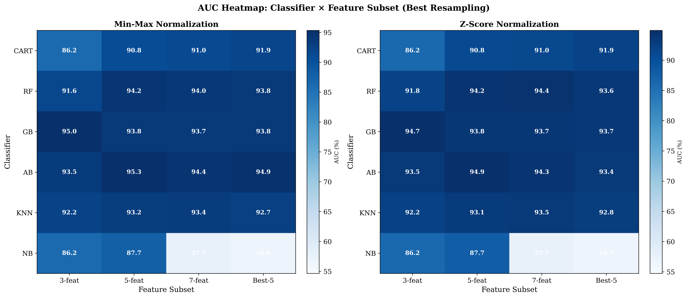
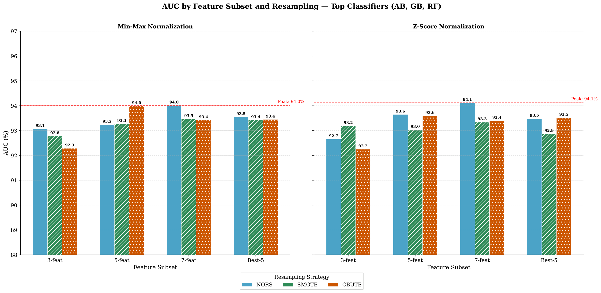

## Min-Max Normalization

### 3-feat (3 Features)

| Classifier | Resampling | Recall (%) | G-Mean (%) | AUC (%) |
|---|---|---|---|---|
| CART | NORS | 90.62 ± 0.88 | 85.42 ± 4.84 | 85.66 ± 4.52 |
| CART | SMOTE | 90.00 ± 0.00 | 86.02 ± 6.49 | 86.22 ± 6.20 |
| CART | CBUTE | 88.12 ± 0.88 | 85.65 ± 4.89 | 85.73 ± 4.78 |
| RF | NORS | 88.12 ± 0.88 | 89.19 ± 4.74 | 91.21 ± 4.87 |
| RF | SMOTE | 88.75 ± 0.00 | 89.92 ± 4.90 | 90.88 ± 4.65 |
| RF | CBUTE | 86.88 ± 2.65 | 91.14 ± 3.17 | 91.60 ± 3.51 |
| GB | NORS | 83.12 ± 4.42 | 89.50 ± 0.08 | 94.51 ± 1.53 |
| GB | SMOTE | 83.12 ± 4.42 | 89.50 ± 0.08 | **95.04 ± 2.61** |
| GB | CBUTE | 87.50 ± 1.77 | 90.20 ± 0.91 | 93.26 ± 1.87 |
| AB | NORS | 87.50 ± 1.77 | 88.90 ± 0.29 | 93.50 ± 2.41 |
| AB | SMOTE | 87.50 ± 1.77 | 89.33 ± 0.31 | 92.40 ± 0.70 |
| AB | CBUTE | 87.50 ± 1.77 | 89.33 ± 0.31 | 91.99 ± 1.37 |
| KNN | NORS | 88.75 ± 1.77 | 90.84 ± 2.12 | 91.40 ± 2.15 |
| KNN | SMOTE | 89.38 ± 0.88 | 92.00 ± 2.86 | 92.24 ± 2.62 |
| KNN | CBUTE | 89.38 ± 0.88 | 90.71 ± 3.51 | 91.07 ± 4.12 |
| NB | NORS | 80.00 ± 5.30 | 73.94 ± 1.11 | 82.92 ± 1.65 |
| NB | SMOTE | 79.38 ± 4.42 | 74.11 ± 0.07 | 84.82 ± 4.80 |
| NB | CBUTE | 79.38 ± 4.42 | 73.22 ± 2.71 | 86.25 ± 2.29 |

### 5-feat (5 Features)

| Classifier | Resampling | Recall (%) | G-Mean (%) | AUC (%) |
|---|---|---|---|---|
| CART | NORS | 95.62 ± 2.65 | 90.59 ± 2.67 | 90.79 ± 2.40 |
| CART | SMOTE | 90.62 ± 0.88 | 90.00 ± 3.31 | 90.05 ± 3.28 |
| CART | CBUTE | 91.25 ± 1.77 | 89.46 ± 0.87 | 89.48 ± 0.88 |
| RF | NORS | 90.62 ± 2.65 | 91.79 ± 3.79 | 93.00 ± 2.96 |
| RF | SMOTE | 91.25 ± 0.00 | 93.40 ± 1.82 | 94.24 ± 2.21 |
| RF | CBUTE | 90.00 ± 1.77 | 92.33 ± 3.32 | 93.20 ± 2.03 |
| GB | NORS | 90.62 ± 2.65 | 92.66 ± 2.57 | 93.81 ± 1.43 |
| GB | SMOTE | 85.00 ± 3.54 | 87.98 ± 1.76 | 91.90 ± 3.49 |
| GB | CBUTE | 88.75 ± 3.54 | 91.26 ± 2.43 | 93.42 ± 1.56 |
| AB | NORS | 90.62 ± 2.65 | 91.35 ± 0.72 | 92.91 ± 0.24 |
| AB | SMOTE | 90.00 ± 3.54 | 91.03 ± 1.17 | 93.68 ± 0.45 |
| AB | CBUTE | 90.62 ± 2.65 | 92.22 ± 0.74 | **95.34 ± 0.28 🏆** |
| KNN | NORS | 90.62 ± 2.65 | 92.65 ± 1.36 | 93.24 ± 1.59 |
| KNN | SMOTE | 90.00 ± 1.77 | 92.76 ± 1.51 | 92.88 ± 1.19 |
| KNN | CBUTE | 90.00 ± 1.77 | 92.76 ± 1.51 | 93.00 ± 1.12 |
| NB | NORS | 91.88 ± 2.65 | 73.97 ± 2.01 | 87.73 ± 1.10 |
| NB | SMOTE | 91.88 ± 2.65 | 79.19 ± 3.17 | 87.22 ± 0.86 |
| NB | CBUTE | 91.88 ± 2.65 | 75.63 ± 0.34 | 87.10 ± 0.74 |

### 7-feat (7 Features)

| Classifier | Resampling | Recall (%) | G-Mean (%) | AUC (%) |
|---|---|---|---|---|
| CART | NORS | 94.38 ± 0.88 | 90.94 ± 3.44 | 91.05 ± 3.28 |
| CART | SMOTE | 90.00 ± 0.00 | 89.72 ± 2.49 | 89.74 ± 2.48 |
| CART | CBUTE | 91.88 ± 0.88 | 90.22 ± 1.06 | 90.24 ± 1.07 |
| RF | NORS | 90.00 ± 1.77 | 93.18 ± 2.11 | 94.04 ± 2.02 |
| RF | SMOTE | 89.38 ± 0.88 | 92.86 ± 1.65 | 93.92 ± 3.83 |
| RF | CBUTE | 90.00 ± 1.77 | 93.18 ± 2.11 | 93.15 ± 2.97 |
| GB | NORS | 90.62 ± 2.65 | 92.66 ± 2.57 | 93.74 ± 1.34 |
| GB | SMOTE | 83.12 ± 2.65 | 89.54 ± 0.28 | 92.76 ± 1.60 |
| GB | CBUTE | 88.75 ± 3.54 | 91.26 ± 2.43 | 92.68 ± 0.52 |
| AB | NORS | 90.62 ± 2.65 | 91.35 ± 0.72 | 94.26 ± 0.03 |
| AB | SMOTE | 90.62 ± 2.65 | 91.79 ± 1.34 | 93.72 ± 0.94 |
| AB | CBUTE | 90.00 ± 3.54 | 91.03 ± 1.17 | 94.42 ± 0.66 |
| KNN | NORS | 90.62 ± 2.65 | 92.65 ± 1.36 | 93.18 ± 1.34 |
| KNN | SMOTE | 90.00 ± 1.77 | 92.76 ± 1.51 | 93.28 ± 1.58 |
| KNN | CBUTE | 90.00 ± 1.77 | 92.76 ± 1.51 | 93.37 ± 1.46 |
| NB | NORS | 100.00 ± 0.00 | 51.81 ± 8.39 | 57.34 ± 12.83 |
| NB | SMOTE | 100.00 ± 0.00 | 51.81 ± 8.39 | 57.66 ± 12.32 |
| NB | CBUTE | 100.00 ± 0.00 | 51.81 ± 8.39 | 57.34 ± 12.81 |

### Best-5 (Best Features)

| Classifier | Resampling | Recall (%) | G-Mean (%) | AUC (%) |
|---|---|---|---|---|
| CART | NORS | 92.50 ± 0.00 | 91.86 ± 0.00 | 91.86 ± 0.00 |
| CART | SMOTE | 90.62 ± 2.65 | 91.36 ± 1.95 | 91.36 ± 1.94 |
| CART | CBUTE | 93.12 ± 0.88 | 90.84 ± 1.07 | 90.86 ± 1.06 |
| RF | NORS | 91.88 ± 0.88 | 93.28 ± 2.89 | 93.78 ± 2.06 |
| RF | SMOTE | 90.62 ± 2.65 | 92.66 ± 3.78 | 93.18 ± 2.89 |
| RF | CBUTE | 90.62 ± 0.88 | 93.08 ± 2.26 | 93.40 ± 2.89 |
| GB | NORS | 90.00 ± 3.54 | 91.90 ± 2.41 | 93.46 ± 0.36 |
| GB | SMOTE | 83.12 ± 4.42 | 89.50 ± 0.08 | 93.80 ± 1.84 |
| GB | CBUTE | 80.00 ± 7.07 | 87.02 ± 3.85 | 92.02 ± 1.41 |
| AB | NORS | 90.62 ± 2.65 | 90.92 ± 1.33 | 93.40 ± 0.45 |
| AB | SMOTE | 90.62 ± 2.65 | 91.79 ± 1.34 | 93.28 ± 0.16 |
| AB | CBUTE | 82.50 ± 14.14 | 89.00 ± 6.51 | 94.92 ± 0.59 |
| KNN | NORS | 91.88 ± 0.88 | 92.42 ± 0.45 | 92.39 ± 0.49 |
| KNN | SMOTE | 90.62 ± 2.65 | 91.79 ± 1.34 | 91.80 ± 1.32 |
| KNN | CBUTE | 90.00 ± 1.77 | 92.76 ± 1.51 | 92.73 ± 1.40 |
| NB | NORS | 100.00 ± 0.00 | 28.06 ± 2.21 | 54.07 ± 3.58 |
| NB | SMOTE | 100.00 ± 0.00 | 28.06 ± 2.21 | 56.64 ± 4.94 |
| NB | CBUTE | 100.00 ± 0.00 | 28.06 ± 2.21 | 48.42 ± 2.94 |

---

## Z-Score Normalization

### 3-feat (3 Features)

| Classifier | Resampling | Recall (%) | G-Mean (%) | AUC (%) |
|---|---|---|---|---|
| CART | NORS | 90.62 ± 0.88 | 85.42 ± 4.84 | 85.66 ± 4.52 |
| CART | SMOTE | 89.38 ± 0.88 | 85.69 ± 8.19 | 85.92 ± 7.88 |
| CART | CBUTE | 90.00 ± 0.00 | 86.07 ± 5.19 | 86.23 ± 4.96 |
| RF | NORS | 88.12 ± 0.88 | 88.76 ± 4.14 | 89.95 ± 3.97 |
| RF | SMOTE | 88.12 ± 0.88 | 90.50 ± 4.08 | 91.53 ± 4.61 |
| RF | CBUTE | 86.88 ± 2.65 | 91.14 ± 3.17 | 91.79 ± 3.38 |
| GB | NORS | 83.12 ± 4.42 | 89.50 ± 0.08 | 94.51 ± 1.53 |
| GB | SMOTE | 82.50 ± 3.54 | 89.17 ± 0.38 | 94.65 ± 3.15 |
| GB | CBUTE | 87.50 ± 1.77 | 90.20 ± 0.91 | 93.96 ± 0.88 |
| AB | NORS | 87.50 ± 1.77 | 88.90 ± 0.29 | 93.50 ± 2.41 |
| AB | SMOTE | 87.50 ± 1.77 | 88.90 ± 0.29 | 93.38 ± 2.09 |
| AB | CBUTE | 87.50 ± 1.77 | 89.33 ± 0.31 | 90.99 ± 0.08 |
| KNN | NORS | 89.38 ± 0.88 | 92.00 ± 1.96 | 92.24 ± 2.47 |
| KNN | SMOTE | 89.38 ± 0.88 | 92.00 ± 2.86 | 92.20 ± 2.69 |
| KNN | CBUTE | 88.12 ± 2.65 | 91.79 ± 3.17 | 91.79 ± 3.14 |
| NB | NORS | 80.00 ± 5.30 | 73.94 ± 1.11 | 82.92 ± 1.65 |
| NB | SMOTE | 79.38 ± 4.42 | 74.60 ± 0.76 | 84.80 ± 4.76 |
| NB | CBUTE | 79.38 ± 4.42 | 73.22 ± 2.71 | 86.24 ± 2.40 |

### 5-feat (5 Features)

| Classifier | Resampling | Recall (%) | G-Mean (%) | AUC (%) |
|---|---|---|---|---|
| CART | NORS | 95.62 ± 2.65 | 90.59 ± 2.67 | 90.79 ± 2.40 |
| CART | SMOTE | 91.25 ± 1.77 | 90.32 ± 1.63 | 90.36 ± 1.60 |
| CART | CBUTE | 88.12 ± 2.65 | 87.92 ± 3.81 | 87.92 ± 3.80 |
| RF | NORS | 92.50 ± 1.77 | **94.02 ± 0.93 🎯** | 94.22 ± 1.48 |
| RF | SMOTE | 90.00 ± 1.77 | 91.90 ± 3.94 | 93.53 ± 3.27 |
| RF | CBUTE | 89.38 ± 2.65 | 92.44 ± 3.17 | 93.38 ± 2.82 |
| GB | NORS | 90.62 ± 2.65 | 92.66 ± 2.57 | 93.81 ± 1.43 |
| GB | SMOTE | 90.00 ± 1.77 | 90.16 ± 3.98 | 91.79 ± 1.78 |
| GB | CBUTE | 80.00 ± 8.84 | 87.34 ± 3.13 | 92.47 ± 1.47 |
| AB | NORS | 90.62 ± 2.65 | 91.35 ± 0.72 | 92.91 ± 0.24 |
| AB | SMOTE | 90.00 ± 3.54 | 91.03 ± 1.17 | 93.78 ± 0.79 |
| AB | CBUTE | 87.50 ± 7.07 | 89.72 ± 3.03 | 94.93 ± 0.47 |
| KNN | NORS | 90.00 ± 1.77 | 92.76 ± 1.51 | 93.04 ± 2.20 |
| KNN | SMOTE | 89.38 ± 2.65 | 92.44 ± 1.97 | 92.73 ± 2.63 |
| KNN | CBUTE | 89.38 ± 2.65 | 92.44 ± 1.97 | 93.08 ± 2.14 |
| NB | NORS | 91.88 ± 2.65 | 73.97 ± 2.01 | 87.73 ± 1.10 |
| NB | SMOTE | 91.88 ± 2.65 | 79.19 ± 3.17 | 87.20 ± 0.88 |
| NB | CBUTE | 91.88 ± 2.65 | 76.17 ± 1.10 | 87.22 ± 1.01 |

### 7-feat (7 Features)

| Classifier | Resampling | Recall (%) | G-Mean (%) | AUC (%) |
|---|---|---|---|---|
| CART | NORS | 94.38 ± 0.88 | 90.94 ± 3.44 | 91.05 ± 3.28 |
| CART | SMOTE | 90.00 ± 0.00 | 90.18 ± 0.62 | 90.18 ± 0.62 |
| CART | CBUTE | 91.25 ± 0.00 | 89.45 ± 2.53 | 89.48 ± 2.48 |
| RF | NORS | 90.62 ± 0.88 | **93.51 ± 1.65** | 94.36 ± 0.17 |
| RF | SMOTE | 90.62 ± 0.88 | **93.51 ± 1.65** | 93.66 ± 1.82 |
| RF | CBUTE | 89.38 ± 2.65 | 92.86 ± 2.57 | 93.62 ± 2.71 |
| GB | NORS | 90.62 ± 2.65 | 92.66 ± 2.57 | 93.74 ± 1.34 |
| GB | SMOTE | 82.50 ± 1.77 | 88.80 ± 0.77 | 92.31 ± 2.33 |
| GB | CBUTE | 80.00 ± 8.84 | 87.34 ± 3.13 | 92.47 ± 1.47 |
| AB | NORS | 90.62 ± 2.65 | 91.35 ± 0.72 | 94.26 ± 0.03 |
| AB | SMOTE | 90.62 ± 2.65 | 91.35 ± 0.72 | 94.04 ± 1.31 |
| AB | CBUTE | 90.00 ± 3.54 | 91.90 ± 1.20 | 94.10 ± 0.47 |
| KNN | NORS | 89.38 ± 2.65 | 92.44 ± 1.97 | 93.11 ± 2.97 |
| KNN | SMOTE | 89.38 ± 2.65 | 92.44 ± 1.97 | 93.11 ± 2.97 |
| KNN | CBUTE | 89.38 ± 2.65 | 92.44 ± 1.97 | 93.46 ± 2.47 |
| NB | NORS | 100.00 ± 0.00 | 51.81 ± 8.39 | 57.26 ± 12.93 |
| NB | SMOTE | 100.00 ± 0.00 | 51.81 ± 8.39 | 57.71 ± 12.26 |
| NB | CBUTE | 100.00 ± 0.00 | 51.81 ± 8.39 | 57.26 ± 12.93 |

### Best-5 (Best Features)

| Classifier | Resampling | Recall (%) | G-Mean (%) | AUC (%) |
|---|---|---|---|---|
| CART | NORS | 92.50 ± 0.00 | 91.86 ± 0.00 | 91.86 ± 0.00 |
| CART | SMOTE | 90.62 ± 2.65 | 91.36 ± 1.95 | 91.36 ± 1.94 |
| CART | CBUTE | 91.25 ± 1.77 | 91.21 ± 1.60 | 91.24 ± 1.60 |
| RF | NORS | 92.50 ± 0.00 | **93.60 ± 2.45** | 93.58 ± 2.43 |
| RF | SMOTE | 90.62 ± 2.65 | 92.66 ± 3.78 | 93.43 ± 2.53 |
| RF | CBUTE | 89.38 ± 2.65 | 92.86 ± 2.57 | 93.48 ± 2.66 |
| GB | NORS | 90.00 ± 3.54 | 91.90 ± 2.41 | 93.46 ± 0.36 |
| GB | SMOTE | 84.38 ± 4.42 | 90.20 ± 1.21 | 92.04 ± 2.53 |
| GB | CBUTE | 81.25 ± 8.84 | 87.67 ± 4.78 | 93.65 ± 0.88 |
| AB | NORS | 90.62 ± 2.65 | 90.92 ± 1.33 | 93.40 ± 0.45 |
| AB | SMOTE | 90.00 ± 3.54 | 91.47 ± 1.80 | 93.14 ± 1.05 |
| AB | CBUTE | 90.62 ± 2.65 | 91.36 ± 1.95 | 93.43 ± 0.28 |
| KNN | NORS | 93.75 ± 0.00 | 91.58 ± 1.27 | 91.56 ± 1.24 |
| KNN | SMOTE | 91.25 ± 3.54 | 91.66 ± 1.16 | 91.60 ± 1.17 |
| KNN | CBUTE | 90.00 ± 1.77 | 92.34 ± 2.11 | 92.77 ± 2.69 |
| NB | NORS | 100.00 ± 0.00 | 28.06 ± 2.21 | 56.17 ± 4.20 |
| NB | SMOTE | 100.00 ± 0.00 | 28.06 ± 2.21 | 56.73 ± 4.68 |
| NB | CBUTE | 100.00 ± 0.00 | 28.06 ± 2.21 | 54.08 ± 3.44 |

---

## 📋 Summary: Best AUC per Classifier × Feature Subset

Each cell shows the best AUC (%) achieved over all resampling strategies.

### Min-Max

| Classifier | 3-feat | 5-feat | 7-feat | Best-5 |
|---|---|---|---|---|
| CART | 86.22 (SMOTE) | 90.79 (NORS) | 91.05 (NORS) | 91.86 (NORS) |
| RF | 91.60 (CBUTE) | 94.24 (SMOTE) | 94.04 (NORS) | 93.78 (NORS) |
| GB | **95.04 (SMOTE)** | 93.81 (NORS) | 93.74 (NORS) | 93.80 (SMOTE) |
| AB | 93.50 (NORS) | **95.34 (CBUTE) 🏆** | 94.42 (CBUTE) | 94.92 (CBUTE) |
| KNN | 92.24 (SMOTE) | 93.24 (NORS) | 93.37 (CBUTE) | 92.73 (CBUTE) |
| NB | 86.25 (CBUTE) | 87.73 (NORS) | 57.66 (SMOTE) | 56.64 (SMOTE) |

### Z-Score

| Classifier | 3-feat | 5-feat | 7-feat | Best-5 |
|---|---|---|---|---|
| CART | 86.23 (CBUTE) | 90.79 (NORS) | 91.05 (NORS) | 91.86 (NORS) |
| RF | 91.79 (CBUTE) | 94.22 (NORS) | 94.36 (NORS) | 93.58 (NORS) |
| GB | 94.65 (SMOTE) | 93.81 (NORS) | 93.74 (NORS) | 93.65 (CBUTE) |
| AB | 93.50 (NORS) | 94.93 (CBUTE) | 94.26 (NORS) | 93.43 (CBUTE) |
| KNN | 92.24 (NORS) | 93.08 (CBUTE) | 93.46 (CBUTE) | 92.77 (CBUTE) |
| NB | 86.24 (CBUTE) | 87.73 (NORS) | 57.71 (SMOTE) | 56.73 (SMOTE) |

*Results from 5-fold stratified cross-validation. Bold = AUC ≥ 95.0%. 🏆 = overall peak.*

---
## 📈 Figures

### Figure 1. AUC heatmap (best resampling) across classifier × feature subset
- PDF: `fig1_heatmap_new.pdf`
- PNG preview:

### Figure 2. AUC by feature subset and resampling (top classifiers: AB, GB, RF)
- PDF: `fig2_grouped_bar_new.pdf`
- PNG preview:

